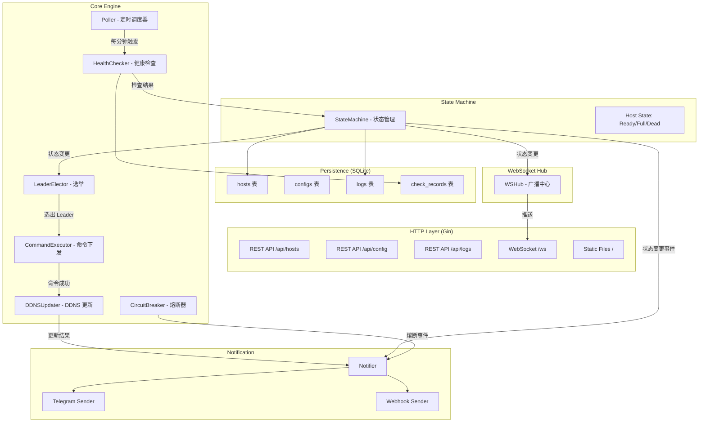
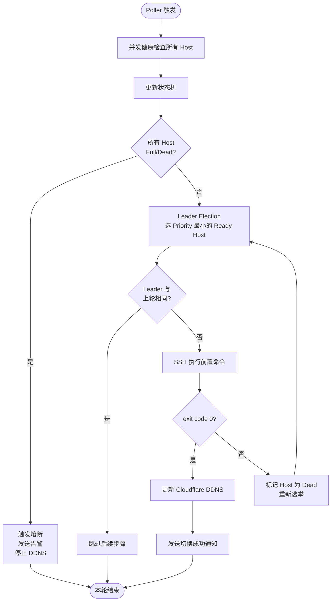
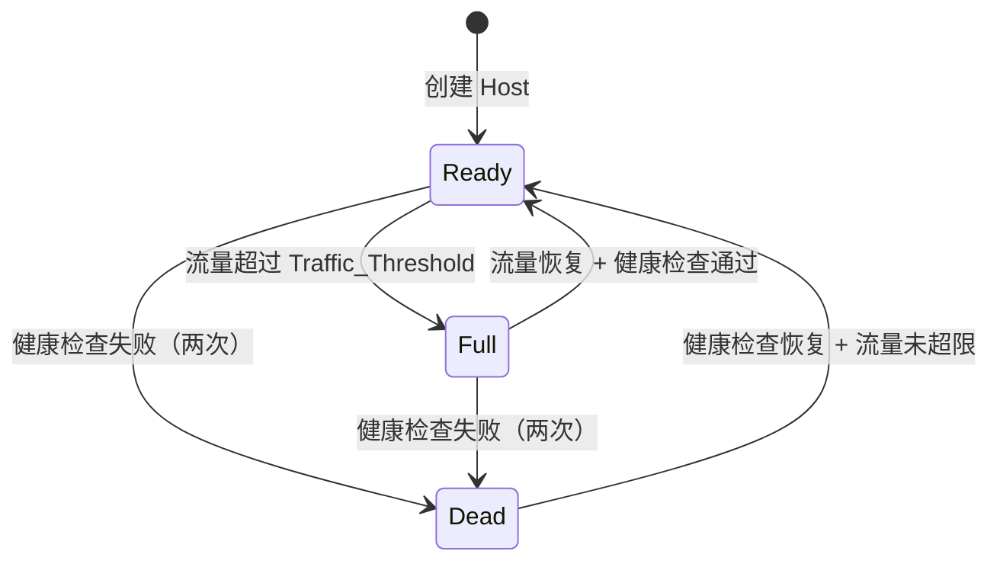

# 技术设计文档：IP 主机池状态机管理系统

## 概述

本系统是基于现有 ippool 项目（Go + Gin + GORM + SQLite + WebSocket）的魔改版本，核心功能是管理一组 IP 主机的健康状态，通过状态机驱动的 Leader Election 机制，自动将 Cloudflare DDNS 指向当前最优可用主机。

**设计原则：**
- 最大化复用现有代码（`ws`、`config`、`auditlog`、`dbcore`、`utils/log`）
- 删除不需要的模块（clients 上报系统、records 监控记录、tasks 任务系统、traffic_rules）
- 新增核心模块：`statemachine`、`healthcheck`、`election`、`executor`、`ddns`、`notifier`
- **前端使用 Go `html/template` 服务端渲染**，配合原生 CSS（毛玻璃风格）和少量 JS（WebSocket 实时更新），内嵌到 Go binary via `embed`
- **保留认证系统**：复用现有 `accounts/sessions`，单管理员账号，登录后 session cookie 鉴权

---

## 架构

### 整体架构图



### 轮询流程图



### 状态机转换图



---

## 组件与接口

### 目录结构（新项目）

```
├── api/
│   ├── auth.go           # 登录/登出 handler
│   ├── hosts.go          # Host CRUD API
│   ├── config.go         # 配置 API
│   ├── logs.go           # 日志查询 API
│   ├── notify.go         # 测试通知 API
│   ├── middleware.go     # session 鉴权中间件
│   └── ws.go             # WebSocket 升级
├── cmd/
│   ├── root.go           # cobra 根命令
│   └── server.go         # 启动服务器
├── config/               # 复用现有 KV 配置系统
├── database/
│   ├── dbcore/           # 复用现有 GORM 初始化（精简）
│   ├── auditlog/         # 复用现有审计日志
│   ├── accounts/         # 复用现有 accounts/sessions（精简）
│   └── models/           # 新数据模型
├── engine/
│   ├── poller.go         # 定时调度器
│   ├── statemachine.go   # 状态机核心
│   ├── healthcheck.go    # 健康检查
│   ├── election.go       # Leader 选举
│   ├── executor.go       # SSH 命令执行
│   ├── ddns.go           # Cloudflare DDNS
│   └── circuit.go        # 熔断器
├── notifier/
│   ├── notifier.go       # 通知分发
│   ├── telegram.go       # Telegram 发送
│   └── webhook.go        # Webhook 发送
├── web/
│   ├── web.go            # embed 入口 + 模板渲染
│   ├── templates/
│   │   ├── base.html     # 基础布局（毛玻璃背景、导航）
│   │   ├── login.html    # 登录页
│   │   ├── index.html    # 监控页（Go template）
│   │   └── settings.html # 设置页（Go template）
│   └── static/
│       ├── style.css     # 毛玻璃样式
│       └── app.js        # WebSocket 实时更新逻辑
├── ws/
│   └── hub.go            # 广播 Hub
└── main.go
```

### 核心接口定义

```go
// engine/statemachine.go
type HostState string

const (
    StateReady HostState = "ready"
    StateFull  HostState = "full"
    StateDead  HostState = "dead"
)

type StateMachine interface {
    Transition(hostID uint, newState HostState, reason string) error
    GetState(hostID uint) HostState
    ForceSet(hostID uint, state HostState) error
}

// engine/healthcheck.go
type CheckResult struct {
    HostID    uint
    Reachable bool
    Latency   time.Duration
    TrafficIn int64  // bytes
    TrafficOut int64 // bytes
    Error     string
}

type HealthChecker interface {
    CheckAll(hosts []models.Host) []CheckResult
}

// engine/election.go
type LeaderElector interface {
    Elect(hosts []models.Host) (*models.Host, error) // nil = 无可用 Host
}

// engine/executor.go
type CommandExecutor interface {
    Execute(host models.Host) (stdout, stderr string, exitCode int, err error)
}

// engine/ddns.go
type DDNSUpdater interface {
    Update(ip, domain string) error
}

// notifier/notifier.go
type EventType string

const (
    EventLeaderChanged    EventType = "leader_changed"
    EventStateTransition  EventType = "state_transition"
    EventDDNSSuccess      EventType = "ddns_success"
    EventDDNSFailed       EventType = "ddns_failed"
    EventCircuitOpen      EventType = "circuit_open"
    EventCircuitClose     EventType = "circuit_close"
)

type Notifier interface {
    Send(event EventType, payload map[string]any)
}
```

---

## 数据模型

### Host 模型

```go
// database/models/host.go
type Host struct {
    ID               uint      `json:"id" gorm:"primaryKey;autoIncrement"`
    Name             string    `json:"name" gorm:"type:varchar(100);not null"`
    IP               string    `json:"ip" gorm:"type:varchar(45);not null"`
    SSHPort          int       `json:"ssh_port" gorm:"default:22"`
    SSHUser          string    `json:"ssh_user" gorm:"type:varchar(100)"`
    SSHPassword      string    `json:"ssh_password,omitempty" gorm:"type:text"`
    SSHPrivateKey    string    `json:"ssh_private_key,omitempty" gorm:"type:text"`
    Priority         int       `json:"priority" gorm:"not null;uniqueIndex:idx_pool_priority"`
    Pool             string    `json:"pool" gorm:"type:varchar(100);not null;uniqueIndex:idx_pool_priority;default:'default'"`
    TrafficThreshold int64     `json:"traffic_threshold" gorm:"type:bigint;default:0"` // bytes, 0=不限制
    PreCommand       string    `json:"pre_command" gorm:"type:text"` // shell 命令或 curl URL
    State            HostState `json:"state" gorm:"type:varchar(20);default:'ready'"`
    LastStateChange  time.Time `json:"last_state_change"`
    IsLeader         bool      `json:"is_leader" gorm:"default:false"`
    CreatedAt        time.Time `json:"created_at"`
    UpdatedAt        time.Time `json:"updated_at"`
}
```

### 检查记录模型

```go
// database/models/check_record.go
type CheckRecord struct {
    ID         uint      `json:"id" gorm:"primaryKey;autoIncrement"`
    HostID     uint      `json:"host_id" gorm:"index"`
    Time       time.Time `json:"time" gorm:"index"`
    Reachable  bool      `json:"reachable"`
    LatencyMs  int64     `json:"latency_ms"`
    TrafficIn  int64     `json:"traffic_in"`
    TrafficOut int64     `json:"traffic_out"`
    Error      string    `json:"error" gorm:"type:text"`
}
```

### 审计日志（复用现有 models.Log）

现有 `models.Log` 结构已满足需求，`MsgType` 字段用于区分事件类型：
- `state_transition` - 状态转换
- `leader_changed` - Leader 变更
- `ddns_update` - DDNS 更新
- `circuit_open` / `circuit_close` - 熔断事件

### 配置项（复用现有 KV 系统）

通过 `config.Set/Get` 存储以下键值：

| Key | 类型 | 说明 |
|-----|------|------|
| `cf_api_token` | string | Cloudflare API Token |
| `cf_zone_id` | string | Cloudflare Zone ID |
| `cf_record_name` | string | 域名 A 记录名 |
| `telegram_bot_token` | string | Telegram Bot Token |
| `telegram_chat_id` | string | Telegram Chat ID |
| `webhook_url` | string | Webhook URL |
| `poll_interval` | int | 轮询间隔（秒，默认 60） |
| `current_leader_id` | uint | 当前 Leader Host ID |
| `max_ssh_concurrency` | int | 最大并发 SSH 连接数（默认 5） |
| `max_health_concurrency` | int | 健康检查最大并发数（默认 10） |

---

## REST API 设计

### 认证

| 方法 | 路径 | 说明 | 鉴权 |
|------|------|------|------|
| GET | `/login` | 渲染登录页 | 无 |
| POST | `/login` | 提交用户名+密码，成功后设置 session cookie | 无 |
| GET | `/logout` | 清除 session，跳转登录页 | 需登录 |

**认证机制：**
- 复用现有 `accounts.CheckPassword` + `accounts.CreateSession`
- 所有 `/api/*` 和页面路由均通过 `AuthMiddleware` 校验 `session_token` cookie
- 未登录请求重定向到 `/login`
- 首次启动若无管理员账号，自动创建默认账号并打印到控制台（复用现有逻辑）

### Host 管理（需登录）

| 方法 | 路径 | 说明 |
|------|------|------|
| GET | `/api/hosts` | 获取所有 Host 列表 |
| GET | `/api/hosts/:id` | 获取单个 Host 详情 |
| POST | `/api/hosts` | 创建 Host |
| PUT | `/api/hosts/:id` | 更新 Host |
| DELETE | `/api/hosts/:id` | 删除 Host |
| PUT | `/api/hosts/:id/state` | 手动设置 Host 状态 |

### 配置管理（需登录）

| 方法 | 路径 | 说明 |
|------|------|------|
| GET | `/api/config` | 获取所有配置 |
| PUT | `/api/config` | 批量更新配置 |
| POST | `/api/notify/test` | 发送测试通知 |

### 日志查询（需登录）

| 方法 | 路径 | 说明 |
|------|------|------|
| GET | `/api/logs` | 查询审计日志（支持分页） |
| GET | `/api/logs/recent` | 获取最近 20 条事件 |

### WebSocket

| 路径 | 说明 |
|------|------|
| `/ws` | 实时状态推送 |

**WebSocket 消息格式：**

```json
// 连接建立后推送完整快照
{
  "type": "snapshot",
  "data": {
    "hosts": [...],
    "leader_id": 1,
    "circuit_open": false,
    "last_poll": "2024-01-01T00:00:00Z"
  }
}

// 状态变更推送
{
  "type": "state_change",
  "data": {
    "host_id": 1,
    "old_state": "ready",
    "new_state": "dead",
    "reason": "SSH timeout",
    "time": "2024-01-01T00:00:00Z"
  }
}

// 轮询摘要推送
{
  "type": "poll_summary",
  "data": {
    "leader_id": 2,
    "circuit_open": false,
    "hosts": [{"id": 1, "state": "dead"}, {"id": 2, "state": "ready"}]
  }
}
```

---

## 核心算法

### 健康检查算法

```
func checkHost(host) CheckResult:
    // 第一次尝试
    result = tcpDial(host.IP, host.SSHPort, timeout=10s)
    if result.failed:
        sleep(5s)
        // 第二次重试
        result = tcpDial(host.IP, host.SSHPort, timeout=10s)
    
    // 流量检查（通过 SSH 读取 /proc/net/dev 或类似）
    if result.reachable:
        traffic = readTraffic(host)
        result.TrafficIn = traffic.in
        result.TrafficOut = traffic.out
    
    return result

// 并发控制：CheckAll 使用 semaphore 限制最大并发数（默认 10）
func CheckAll(hosts []Host) []CheckResult:
    sem = make(chan struct{}, maxConcurrency=10)
    results = make([]CheckResult, len(hosts))
    wg = sync.WaitGroup{}
    for i, host in hosts:
        wg.Add(1)
        sem <- struct{}{}
        go func(i, host):
            defer wg.Done()
            defer <- sem
            results[i] = checkHost(host)
        ()
    wg.Wait()
    return results
```

### 状态转换规则

```
合法转换矩阵：
  Ready → Full:  流量超限
  Ready → Dead:  健康检查失败
  Full  → Ready: 流量恢复 AND 健康检查通过
  Full  → Dead:  健康检查失败
  Dead  → Ready: 健康检查通过 AND 流量未超限

非法转换：直接返回错误，不修改状态
```

### Leader Election 算法

```
func elect(hosts []Host) *Host:
    readyHosts = filter(hosts, state == Ready)
    if len(readyHosts) == 0:
        return nil  // 触发熔断
    
    sort(readyHosts, by=Priority ascending)
    return readyHosts[0]  // Priority 最小的
```

### SSH 命令执行安全性

```
// 并发控制：CommandExecutor 使用 semaphore 限制最大并发 SSH 连接数（默认 5）
// 防止主机较多时瞬时消耗过多本地文件句柄
type CommandExecutor struct {
    sem chan struct{} // 容量 = maxSSHConcurrency（默认 5）
}

func Execute(host Host) (stdout, stderr string, exitCode int, err error):
    executor.sem <- struct{}{}
    defer <- executor.sem

    // SSH 连接超时：30s
    ctx, cancel = context.WithTimeout(context.Background(), sshConnectTimeout=30s)
    defer cancel()
    client = sshDial(ctx, host.IP, host.SSHPort, host.SSHUser, ...)

    // 命令执行超时：60s（独立 context，防止 curl 挂起阻塞 Poller）
    execCtx, execCancel = context.WithTimeout(context.Background(), cmdExecTimeout=60s)
    defer execCancel()
    stdout, stderr, exitCode = runCommand(execCtx, client, host.PreCommand)
    return
```

**关键约束：**
- SSH 连接和命令执行均使用独立的 `context.WithTimeout`，互不影响
- 命令执行超时（60s）视同 exit code 非 0，触发 Host 标记为 Dead 并重新选举
- semaphore 容量通过配置项 `max_ssh_concurrency`（默认 5）控制，可在设置页调整

### 熔断器逻辑

```
func checkCircuit(hosts []Host) bool:
    for host in hosts:
        if host.State == Ready:
            return false  // 有 Ready Host，不熔断
    return true  // 全部 Full/Dead，触发熔断

// 熔断状态持久化在内存中，重启后重新评估
```

---

## 前端页面结构

**技术方案：Go `html/template` 服务端渲染 + 原生 CSS + 少量 JS**

- 服务端用 Go template 渲染初始 HTML（含主机列表、配置数据等），避免首屏空白
- JS 仅负责 WebSocket 实时更新 DOM，以及表单提交的 fetch 调用
- 所有模板和静态文件通过 `embed.FS` 打包进 binary

### 登录页（login.html）

```
┌─────────────────────────────────────┐
│         IP Pool Monitor             │
│                                     │
│  ┌─────────────────────────────┐    │
│  │  用户名  [____________]     │    │
│  │  密  码  [____________]     │    │
│  │         [  登 录  ]         │    │
│  └─────────────────────────────┘    │
│  毛玻璃卡片，深色渐变背景             │
└─────────────────────────────────────┘
```

### 监控页（index.html）

```
┌─────────────────────────────────────────────────────┐
│  IP Pool Monitor              [设置] [退出登录]       │
├─────────────────────────────────────────────────────┤
│  ┌─────────────────────────────────────────────┐    │
│  │  系统状态栏（毛玻璃卡片）                      │    │
│  │  Leader: host-1  域名: example.com           │    │
│  │  最后切换: 2024-01-01 12:00:00               │    │
│  │  "当前正在承接流量的主机"                      │    │
│  └─────────────────────────────────────────────┘    │
│                                                     │
│  ┌──────────────┐  ┌──────────────┐                 │
│  │ host-1       │  │ host-2       │                 │
│  │ 1.2.3.4      │  │ 5.6.7.8      │                 │
│  │ ● Ready      │  │ ● Full       │                 │
│  │ [████░░] 60% │  │ [██████] 100%│                 │
│  │ Priority: 1  │  │ Priority: 2  │                 │
│  └──────────────┘  └──────────────┘                 │
│  "主机池中所有受管主机的实时状态"                      │
│                                                     │
│  ┌─────────────────────────────────────────────┐    │
│  │ ⚠ 熔断告警（仅熔断时显示，红色横幅）           │    │
│  │ 所有主机均不可用，请立即介入                   │    │
│  └─────────────────────────────────────────────┘    │
│                                                     │
│  ┌─────────────────────────────────────────────┐    │
│  │  最近事件流                                   │    │
│  │  12:01 [Leader变更] host-1 → host-2          │    │
│  │  12:00 [状态转换] host-1: Ready → Dead       │    │
│  │  "系统最近的自动操作记录"                      │    │
│  └─────────────────────────────────────────────┘    │
└─────────────────────────────────────────────────────┘
```

**Go template 渲染数据结构：**
```go
type IndexPageData struct {
    Leader      *models.Host
    Hosts       []models.Host
    Domain      string
    CircuitOpen bool
    RecentLogs  []models.Log
    LastPoll    time.Time
}
```

### 设置页（settings.html）

分组展示，每组一个毛玻璃卡片，服务端渲染初始值：
1. **主机管理** - 表格列出所有 Host，行内操作按钮（编辑/删除），底部"添加主机"按钮触发模态框
2. **DDNS 配置** - CF API Token、Zone ID、Record Name，保存按钮
3. **通知配置** - Telegram Token+ChatID、Webhook URL，保存按钮 + 测试通知按钮
4. **轮询参数** - 轮询间隔输入框（最小 10 秒校验），保存按钮
5. **账号安全** - 修改管理员密码表单

**毛玻璃样式核心 CSS：**
```css
.glass-card {
    background: rgba(255, 255, 255, 0.08);
    backdrop-filter: blur(12px);
    -webkit-backdrop-filter: blur(12px);
    border: 1px solid rgba(255, 255, 255, 0.15);
    border-radius: 16px;
    padding: 24px;
}

body {
    background: linear-gradient(135deg, #0f0c29, #302b63, #24243e);
    min-height: 100vh;
    color: #e0e0e0;
    font-family: -apple-system, BlinkMacSystemFont, 'Segoe UI', sans-serif;
}
```

---

## WebSocket Hub 设计

复用现有 `ws.SafeConn`，新增广播 Hub：

```go
// ws/hub.go
type Hub struct {
    clients map[int64]*SafeConn
    mu      sync.RWMutex
}

func (h *Hub) Register(conn *SafeConn)
func (h *Hub) Unregister(conn *SafeConn)
func (h *Hub) Broadcast(msg any)  // 向所有连接广播
```

---

## 错误处理

| 场景 | 处理策略 |
|------|---------|
| SSH 连接失败 | 重试 1 次（5s 后），两次失败标记 Dead |
| 前置命令非 0 退出 | 标记 Host Dead，重新选举 |
| CF API 失败 | 重试 3 次（间隔 5s），全部失败发告警 |
| 通知发送失败 | 记录日志，不影响主流程 |
| 数据库写入失败 | 记录错误日志，继续执行 |
| 所有 Host 不可用 | 触发熔断，停止 DDNS，发告警 |
| WebSocket 断开 | 从 Hub 移除，释放资源 |

---

## Docker 配置

### Dockerfile（多阶段构建）

```dockerfile
# 构建阶段
FROM golang:1.24-alpine AS builder
WORKDIR /app
COPY go.mod go.sum ./
RUN go mod download
COPY . .
RUN CGO_ENABLED=1 GOOS=linux go build -ldflags="-s -w" -o ippool .

# 运行阶段
FROM alpine:3.19
RUN apk add --no-cache ca-certificates sqlite-libs
WORKDIR /app
COPY --from=builder /app/ippool .
VOLUME ["/data"]
EXPOSE 8080
ENV PORT=8080
ENV DB_PATH=/data/ippool.db
ENTRYPOINT ["./ippool", "server"]
```

### docker-compose.yml

```yaml
version: '3.8'
services:
  ippool:
    build: .
    ports:
      - "${PORT:-8080}:8080"
    volumes:
      - ippool_data:/data
    environment:
      - PORT=8080
      - DB_PATH=/data/ippool.db
    restart: unless-stopped

volumes:
  ippool_data:
```

---

## 正确性属性

*属性是在系统所有有效执行中都应成立的特征或行为——本质上是关于系统应该做什么的形式化陈述。属性是人类可读规范与机器可验证正确性保证之间的桥梁。*

### 属性 1：Host 创建初始状态不变量

*对任意* 有效的 Host 创建请求（合法 IP、合法 Priority），创建后该 Host 的状态必须为 Ready，且分配的 ID 在系统中唯一。

**验证：需求 1.2**

### 属性 2：非法 IP 格式拒绝

*对任意* 不符合 IPv4/IPv6 格式的字符串作为 Host IP 提交，系统必须返回 HTTP 400 错误。

**验证：需求 1.3**

### 属性 3：同 Pool Priority 唯一性

*对任意* Pool 和 Priority 值，若该 Pool 内已存在相同 Priority 的 Host，则新建请求必须返回 HTTP 409。

**验证：需求 1.4**

### 属性 4：状态转换合法性

*对任意* Host 当前状态和目标状态，只有以下转换合法：Ready→Full、Ready→Dead、Full→Ready、Full→Dead、Dead→Ready；其他转换必须被拒绝。

**验证：需求 2.1**

### 属性 5：流量超限触发 Full

*对任意* Host 和 Traffic_Threshold，当单向流量（入站或出站）超过阈值时，状态机必须将该 Host 转换为 Full。

**验证：需求 2.2**

### 属性 6：状态转换必须记录审计日志

*对任意* Host 状态转换（无论原因），系统必须在审计日志中记录包含前后状态、转换原因和时间戳的条目。

**验证：需求 2.4**

### 属性 7：流量比较正确性

*对任意* 流量值和 Traffic_Threshold，当流量 > 阈值时判定为超限，当流量 ≤ 阈值时判定为正常；比较结果必须与数值大小严格一致。

**验证：需求 3.3**

### 属性 8：Leader 选举最小 Priority

*对任意* 非空的 Ready Host 集合，Leader Election 必须选出 Priority 值最小的 Host 作为 Leader。

**验证：需求 4.1**

### 属性 9：Leader 不变时跳过操作

*对任意* 连续两轮选举结果相同（同一 Host 且状态仍为 Ready）的情况，系统必须跳过前置命令下发和 DDNS 更新。

**验证：需求 4.3**

### 属性 10：Leader 变更必须记录

*对任意* Leader 变更事件（前任 Leader ID ≠ 新任 Leader ID），系统必须记录包含变更时间、前任 ID 和新任 ID 的事件。

**验证：需求 4.4**

### 属性 11：前置命令失败触发重新选举

*对任意* 前置命令返回非 0 exit code 的 Host，系统必须将该 Host 标记为 Dead 并触发重新选举。

**验证：需求 5.4**

### 属性 12：熔断条件正确性

*对任意* Host 集合，当且仅当集合中所有 Host 的状态均为 Full 或 Dead 时，熔断器才应触发；只要存在至少一台 Ready Host，熔断器不应触发。

**验证：需求 7.1**

### 属性 13：熔断自动解除

*对任意* 处于熔断状态的系统，当至少一台 Host 状态恢复为 Ready 时，熔断器必须自动解除。

**验证：需求 7.4**

### 属性 14：DDNS 更新结果必须记录审计日志

*对任意* DDNS 更新操作（无论成功或失败），系统必须在审计日志中记录包含目标 IP、操作结果和时间戳的条目。

**验证：需求 6.5**

---

## 测试策略

### 单元测试

重点覆盖以下模块的具体示例和边界条件：
- `engine/statemachine.go`：状态转换矩阵的每条合法/非法路径
- `engine/election.go`：空集合、单元素、多元素的选举结果
- `engine/healthcheck.go`：TCP 超时、重试逻辑
- `engine/ddns.go`：CF API 调用参数、重试次数
- `notifier/`：消息格式验证

### 属性测试

使用 [gopter](https://github.com/leanovate/gopter) 作为属性测试库，每个属性测试运行最少 100 次迭代。

每个属性测试用注释标注对应设计属性：
```go
// Feature: ip-pool-state-machine, Property 8: Leader 选举最小 Priority
func TestLeaderElectionMinPriority(t *testing.T) { ... }
```

**核心属性测试：**
- 属性 2：生成随机非法 IP 字符串（随机长度、随机字符），验证均返回 400
- 属性 3：生成随机 Pool 名和 Priority 值，插入两次，验证第二次 409
- 属性 4：生成随机（当前状态，目标状态）对，验证合法性判断与转换矩阵一致
- 属性 5：生成随机 threshold 和超过 threshold 的流量值，验证状态变为 Full
- 属性 7：生成随机流量值和阈值，验证比较结果与 `traffic > threshold` 严格一致
- 属性 8：生成随机 Ready Host 集合（随机 Priority），验证选出的是 Priority 最小的
- 属性 12：生成随机 Host 状态组合，验证熔断条件判断正确

### 集成测试

- 完整轮询流程（mock SSH、mock CF API）
- WebSocket 推送时序验证
- 数据库持久化与重启恢复

### 冒烟测试

- Docker 容器启动验证
- 数据库文件路径环境变量覆盖
- 配置持久化重启后自动加载
